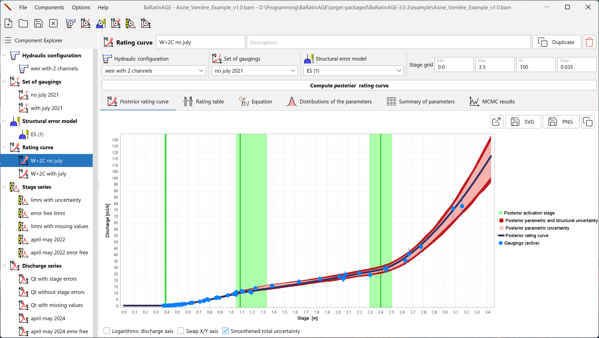

<h1 align="center"> BaRatinAGE </h1>

BaRatin Advanced Graphical Environment

[English version follows > ](#Overview)

## Présentation générale

BaRatin (BAyesian RATINg curve) est une méthode d'estimation des courbes de tarage et des incertitudes associées à l'aide d'un formalisme bayésien. Ce dépôt contient l'interface graphique de BaRatin, nommée BaRatinAGE.

Pour plus d'information sur **BaRatin** et **BaRatinAGE**, visitez le site web dédié : [baratin-tools.github.io/fr/](https://baratin-tools.github.io/fr/).

## Téléchargement et installation

Pour télécharger la dernière version de **BaRatinAGE**, rendez-vous sur la page [https://github.com/BaRatin-tools/BaRatinAGE/releases/latest](https://github.com/BaRatin-tools/BaRatinAGE/releases/latest).
Choisissez l'archive adaptée à votre système d'exploitation (Windows ou Linux) : `BaRatinAGE-x.x.x_Windows.zip` ou `BaRatinAGE-x.x.x_Linux.tar.gz`.

**BaRatinAGE** ne nécessite aucune installation.
Il vous suffit de dézipper / décompresser l'archive dans le répertoire de votre choix.

## Première utilisation

Pour lancer **BaRatinAGE**:

- sur Windows, à la racine du dossier contenant BaRatinAGE que vous venez de décompresser, il vous suffit de double-cliquer sur l'exécutable nommé **BaRatinAGE.exe** qui s'y trouve.
- sur Linux, dans le sous-dossier `bin\` du dossier contenant BaRatinAGE que vous venez de décompresser, il vous suffit de double-cliquer sur l'exécutable nommé **BaRatinAGE** qui s'y trouve (ou de le lancer en ligne de commande : `./BaRatinAGE`).

Vous pouvez tester **BaRatinAGE** en utilisant le fichier projet (`*.bam`) exemple situé dans le répertoir `example\`.

## Aide

L'aide de **BaRatinAGE** est accessible en ligne : [baratin-tools.github.io/fr/doc/baratinage/](https://baratin-tools.github.io/fr/doc/baratinage/).

Vous pouvez également poser vos questions en envoyant un message à **baratin.dev [at] inrae.fr**.

## Contributions

### Bugs

Si vous rencontrez des problèmes ou bugs lors de l'utilisation de **BaRatinAGE**, n'hésitez pas à nous en faire part.
La meilleure solution est d'avoir un compte Github et de créer une nouvelle _issue_ en cliquant sur `New Issue` sur la page [https://github.com/BaRatin-tools/BaRatinAGE/issues](https://github.com/BaRatin-tools/BaRatinAGE/issues).
Sinon, vous pouvez nous envoyer un courriel à l'adresse **baratin.dev [at] inrae.fr**.
Dans tous les cas, soyez le plus exhaustif possible dans la description du problème.

### Multilinguisme

Les contributions pour traduire BaRatinAGE vers d'autres langues sont bienvenues !
Pour plus d'information visitez [baratin-tools.github.io/en/doc/baratinage/going-further/](https://baratin-tools.github.io/en/doc/baratinage/going-further/).

### Développement

Pour plus d'informations sur le développement de BaRatinAGE, consultez le fichier `CONTRIBUTING.md` (anglais uniquement) à la racine du dépot Github: [github.com/BaRatin-tools/BaRatinAGE/blob/main/CONTRIBUTING.MD](https://github.com/BaRatin-tools/BaRatinAGE/blob/main/CONTRIBUTING.MD).

---

## Overview

BaRatin (BAyesian RATINg curve) is a Bayesian approach to the estimation of rating curves and associated uncertainties. This repository contains BaRatin graphical interface, named BaRatinAGE.

For more information on **BaRatin** and **BaRatinAGE**, visit the dedicated website: [baratin-tools.github.io/en/](https://baratin-tools.github.io/en/).

## Download and installation

To download the latest version of **BaRatinAGE**, go to the page [https://github.com/BaRatin-tools/BaRatinAGE/releases/latest](https://github.com/BaRatin-tools/BaRatinAGE/releases/latest).
Choose the .zip archive which matches your operating system (Windows or Linux): `BaRatinAGE-x.x.x_Windows.zip` or `BaRatinAGE-x.x.x_Linux.tar.gz`.

**BaRatinAGE** doesn't require any installation.
You simply need to unzip / uncompress the .zip archive in the folder of your choice.

## Getting started

To run **BaRatinAGE**:

- on Windows, at the root of the folder which contains **BaRatinAGE** (that you've just uncompressed), double-click on the executable file named **BaRatinAGE.exe**.
- on Linux: in the subfolder `bin\` of the folder containing the unzipped **BaRatinAGE**, double-click on the executable file named **BaRatinAGE** (or using the terminal, run `./BaRatinAGE`).

You can test **BaRatinAGE** using the example project file (`*.bam`) located in the subfolder `example\`.

## Help

To access the help of **BaRatinAGE**, visit [baratin-tools.github.io/en/doc/baratinage/](https://baratin-tools.github.io/en/doc/baratinage/).

You can also reach out and ask your questions by sending an email to **baratin.dev [at] inrae.fr**.

## Contributions

### Bugs

If you encounter bugs or any problem when using **BaRatinAGE**, please let us know.
The best way to do so is to have a Github account and open a new _issue_ by clicking `New Issue` on the page [https://github.com/BaRatin-tools/BaRatinAGE/issues](https://github.com/BaRatin-tools/BaRatinAGE/issues).
Alternatively, you can send an email to **baratin.dev [at] inrae.fr**.
Please, be as exhaustive as possible when describing the issue.

### Multi-language support

Contributions to translate BaRatinAGE in any language are welcome! Visit [baratin-tools.github.io/en/doc/baratinage/going-further/](https://baratin-tools.github.io/en/doc/baratinage/going-further/) for more information.

### Development

For more information on BaRatinAGE development, please see the file `CONTRIBUTING.md` at the repository root: [https://github.com/BaRatin-tools/BaRatinAGE/blob/main/CONTRIBUTING.MD](https://github.com/BaRatin-tools/BaRatinAGE/blob/main/CONTRIBUTING.MD).
